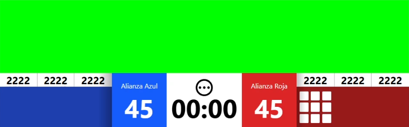
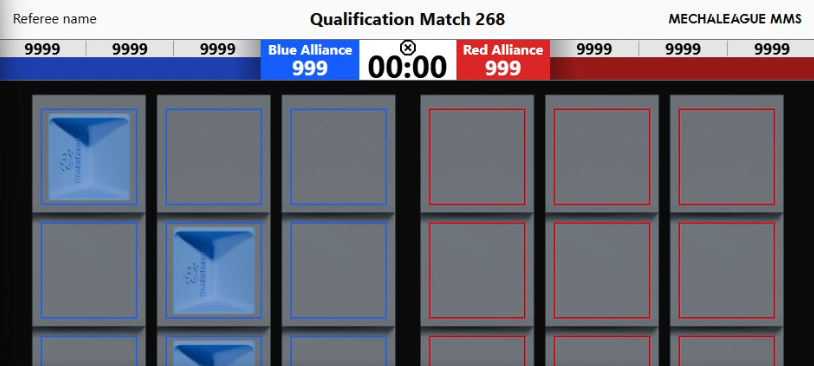

<p align="center">
    
    
    
    
    
    
</p>

<p align="center">
    
    <h1 align="center">MechaLeague MMS</h1>
    <p align="center">The MechaLeague <b>Match Management System</b>, successor to the MechaLeague Match Manager</p>
</p>


# Features

## Automatic robot &harr; MMS synchronization
The MMS automatically syncs relevant data to connected robots, allowing for real-time communication and telemetry, enabling a streamlined control flow for MechaLeague events

(Insert gif here)

## Automatic cloud (MechaLeague Events) data uploading
The MMS automatically uploads team, match and alliance data results to MechaLeague Events, so anyone can view results as soon as they're ready!

(Insert image here)

## Real-time audience displays
The MMS exposes beautiful, animated, real-time audience displays and overlays on the local network, this way spectators always know what's going on!


## Real-time referee scoring
The MMS allows multiple devices to be registered as referees, on wich referees can enter their score to be automatically counted towards the final result



# Development and Building
(Node JS v21.6.1 and Python 3.10.9 used)

1. Clone the repository
2. Install frontend dependencies
```sh
cd frontend
npm i
```
3. Create a virtual environment for python
```sh
python -m venv .venv
```

Activate virtual environment

For Windows
```sh
.venv\Scripts\activate
```

For Unix
```sh
source .venv/bin/activate
```
4. Install Python dependencies
```sh
pip install -r requirements.txt
```

5. Run development server with FastAPI
```sh
fastapi dev --host 0.0.0.0
```

6. Run build script
```sh
python scripts/build.py
```
This will build the MMS for the current OS and generate a zip file containing all build contents for distribution